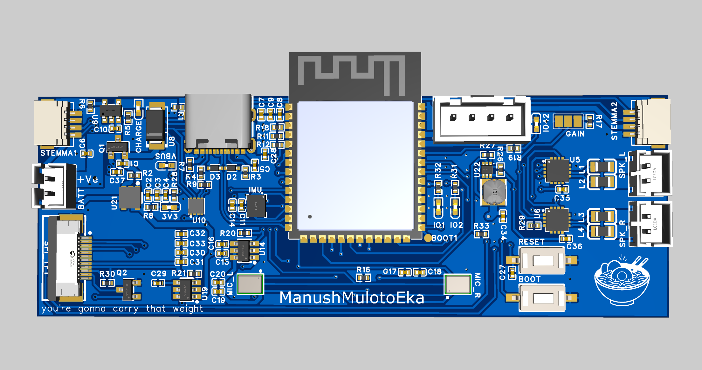
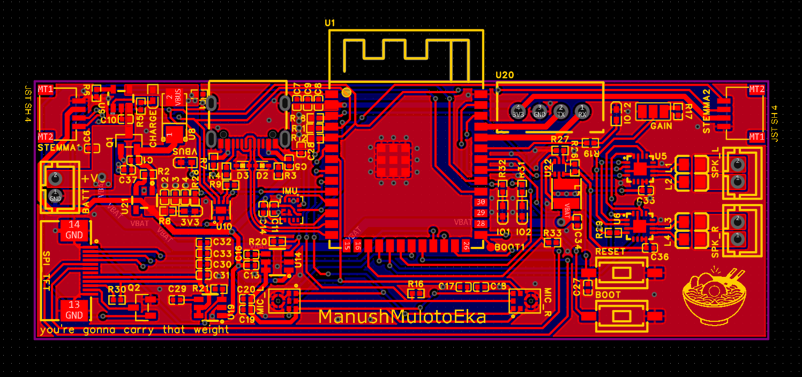

<div align="center">

# ESP32 Talking Agent

**A compact, battery-powered voice interface platform**

ESP32-S3 · Stereo I²S Audio · TFT Display · 6-axis IMU · USB-C · LiPo

[](hardware/)
[](https://www.espressif.com/en/products/socs/esp32-s3)
[](https://platformio.org/)
[](LICENSE)

<br>



<br>
<br>



</div>

---

## Overview

Custom ESP32-S3 board designed as a standalone voice interface. The hardware brings together stereo digital microphones, stereo Class-D amplifiers, a TFT display, IMU, and battery management on a single compact PCB — everything needed to build an always-on talking agent.

**Status:** Hardware bring-up complete. IMU and microphone subsystems verified. Audio pipeline and display UI in development.

---

## Hardware

| Subsystem | Part | Notes |
|-----------|------|-------|
| MCU | ESP32-S3-WROOM-1 | 16 MB Flash · 8 MB PSRAM · 240 MHz dual-core |
| Microphones | ICS-43434 × 2 | Stereo I²S · flat to 20 kHz · 65 dBA SNR |
| Amplifiers | MAX98357A × 2 | Stereo I²S · 3 W Class-D · no config needed |
| Display | TFT (SPI) | PWM backlight dimming |
| IMU | LSM6DSOXTR | 6-axis accel + gyro · I²C |
| Fuel gauge | MAX17048 | LiPo SOC over I²C |
| Charger | MCP73831T | Single-cell LiPo |
| Power gating | TPS22918 × 3 | Per-rail load switches (mics, display, amps) |
| Power path | DMG3415U | USB/battery switchover |

<details>
<summary><b>Pin assignments</b></summary>
<br>

| Signal | GPIO | Description |
|--------|------|-------------|
| I2S_MIC_SCK | 7 | Microphone bit clock |
| I2S_MIC_SD | 15 | Microphone serial data |
| I2S_MIC_WS | 16 | Microphone word select |
| MIC_EN | 6 | Mic power enable (TPS22918) |
| I2S_SPK_BCLK | 10 | Amplifier bit clock |
| I2S_SPK_LRCLK | 11 | Amplifier LR clock |
| I2S_SPK_DIN | 12 | Amplifier data in |
| SPK_EN | 9 | Amplifier enable |
| SPI_MOSI | 14 | Display data |
| SPI_SCK | 13 | Display clock |
| SPI_CS | 21 | Display chip select |
| TFT_DC | 47 | Display data/command |
| TFT_RST | 48 | Display reset |
| TFT_DIM | 39 | Backlight PWM |
| TFT_EN | 38 | Display power enable (TPS22918) |
| I2C_SDA | 5 | I²C data (IMU, fuel gauge, STEMMA) |
| I2C_SCL | 4 | I²C clock |
| IMU_INT1 | 18 | LSM6DSOXTR interrupt 1 |
| IMU_INT2 | 8 | LSM6DSOXTR interrupt 2 |
| FUEL_INT | 17 | MAX17048 alert |
| LED_1/2/3 | 1, 2, 42 | Status LEDs |

</details>

---

## Firmware

Built with [PlatformIO](https://platformio.org/) + Arduino framework on ESP-IDF v5.

```
firmware/src/
├── main.cpp        # Boot sequence, subsystem init
├── imu_test.cpp    # IMU diagnostic (serial table or WiFi UDP stream)
└── mic_test.cpp    # Stereo mic capture → WAV via Serial or WiFi HTTP
```

### Quick start

**Prerequisites**
```bash
# PlatformIO CLI or VS Code extension
pip install pyserial pygame numpy sounddevice
```

**WiFi credentials** (required for WiFi modes)
```bash
cp firmware/secrets.h.example firmware/include/wifi_config.h
# fill in WIFI_SSID and WIFI_PASS
```

---

### `imu-test` — IMU diagnostic

Streams LSM6DSOXTR accel, gyro, and temperature. Two modes selectable at build time.

```bash
pio run -e imu-test -t upload
```

**Serial** (default) — verbose table + ASCII bar graphs at 10 Hz:
```bash
pio device monitor -e imu-test
```

**WiFi UDP** — CSV stream at 100 Hz into the pygame visualizer. Uncomment `-DIMU_WIFI=1` in `platformio.ini`, then:
```bash
python imu_visualizer.py udp
```

The visualizer renders a live 3D wireframe cube, artificial horizon, and dual oscilloscope panels.

---

### `mic_test` — Stereo microphone capture

Records 5 s of 48 kHz · 24-bit stereo audio into PSRAM (~1.4 MB), then transfers the WAV to a PC.

```bash
pio run -e mic_test -t upload
```

**Option 1 — USB Serial** (no WiFi needed):
```bash
python tools/receive_wav.py COM4
# type "1" at the prompt — handles recording, capture, and saves the WAV
```

**Option 2 — WiFi HTTP**:
```
type "2" at the prompt
open http://<printed-IP>/ in a browser
→ Download WAV  or  Re-record
```

Gain is adjustable in `firmware/include/mic_audio.h`:
```cpp
#define MIC_GAIN_DB   0.0f   // record flat, normalize in post for best quality
```

---

## Repository layout

```
├── firmware/
│   ├── src/                  # Firmware source
│   ├── include/              # Headers and pin config
│   └── secrets.h.example     # WiFi credentials template
├── tools/
│   └── receive_wav.py        # WAV serial receiver
├── img/                      # Board photos and renders
├── hardware/                 # Schematics, gerbers, BOM
├── imu_visualizer.py         # Pygame IMU visualizer
└── platformio.ini
```

---

## Design notes

- **ESP32-S3** — chosen for native USB CDC, vector instructions for on-device ML, and the larger PSRAM needed to buffer raw audio
- **ICS-43434** — flat frequency response, low noise floor, no external decoupling capacitors required
- **MAX98357A** — I²S direct drive, no I²C configuration, filterless Class-D with built-in EMI shaping
- **Per-rail power gating** — TPS22918 load switches cut power to mics, display, and amps independently, reducing idle draw and preventing mic noise coupling during playback
- **PSRAM audio buffer** — 5 s stereo 24-bit at 48 kHz = ~1.4 MB, well within the 8 MB OPI PSRAM

---

## License

MIT — see [LICENSE](LICENSE).
